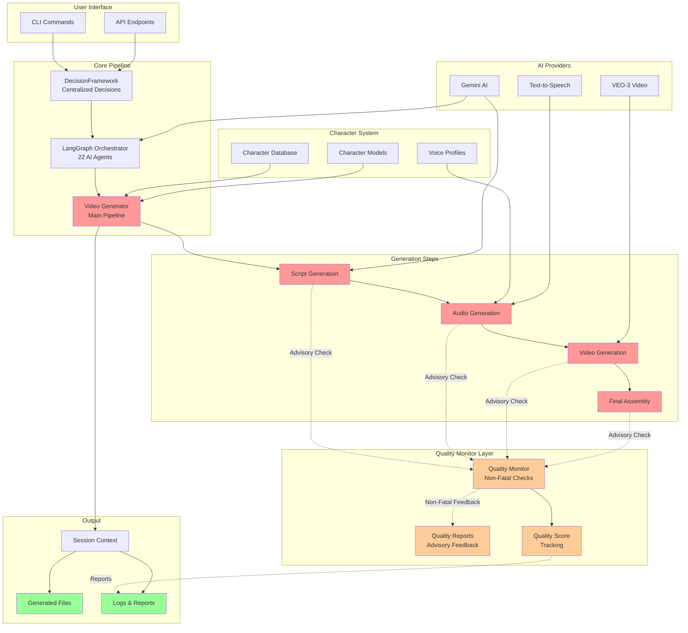
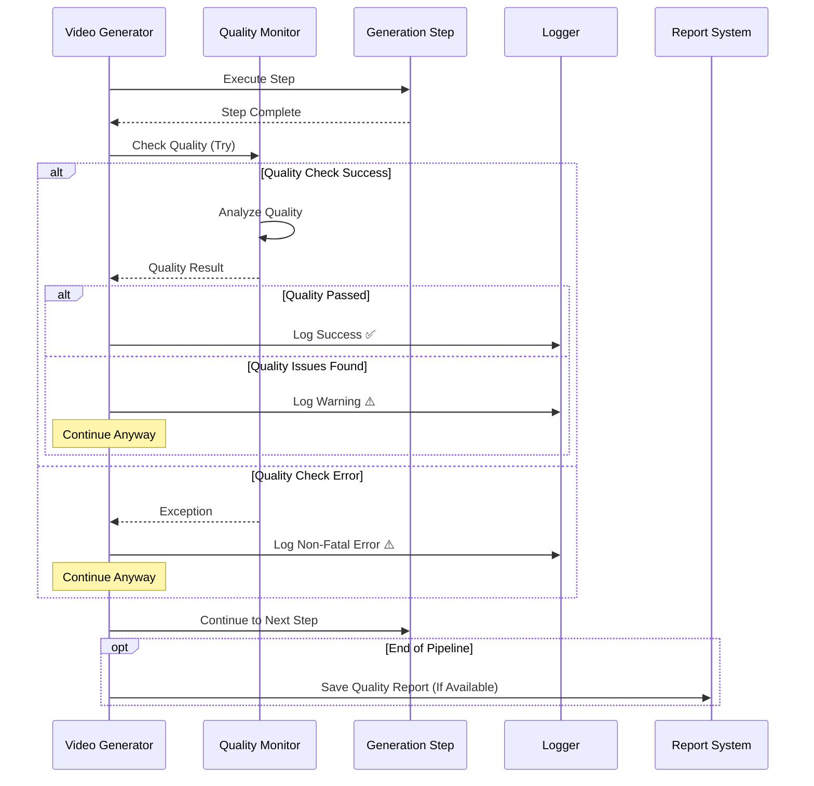
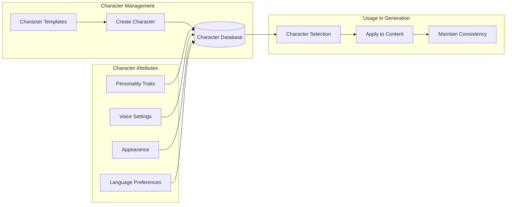
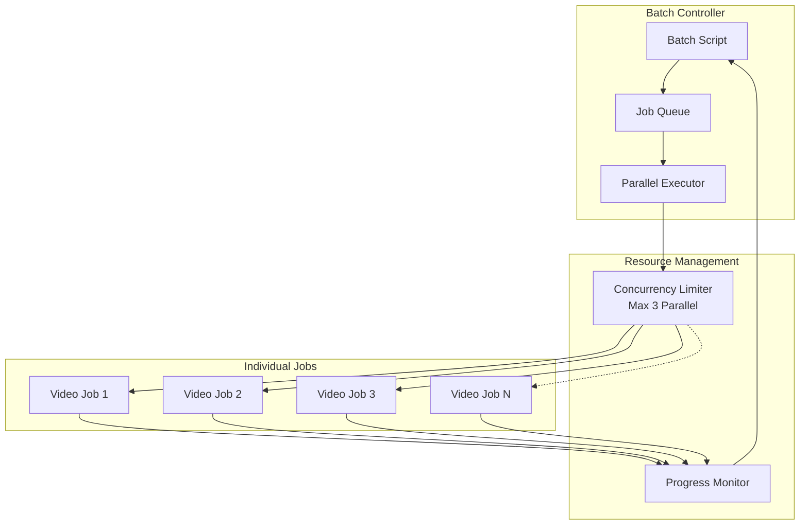

# ViralAI Architecture with Quality Monitor System

## Overview
The ViralAI system has been enhanced with a non-fatal quality monitoring system that provides advisory feedback without interrupting the generation pipeline.

## System Architecture Block Diagram



## Quality Monitor Flow (Non-Fatal)



## Character System Architecture



## Key Improvements

### 1. Non-Fatal Quality Monitoring
- **Before**: Quality checks could fail the entire pipeline
- **After**: Quality checks are advisory only - they log warnings but never stop generation
- **Implementation**: All quality checks wrapped in try-except blocks with graceful degradation

### 2. Character System Integration
- Comprehensive character database with 40+ attributes
- Template-based character creation for quick setup
- Voice and appearance consistency throughout videos
- Multi-language support with character preferences

### 3. Error Handling Philosophy
```python
# Old Approach (Fatal)
quality_result = quality_monitor.check_step_quality(step)
if not quality_result.passed:
    raise Exception("Quality check failed")

# New Approach (Non-Fatal)
try:
    quality_result = quality_monitor.check_step_quality(step)
    if not quality_result.passed:
        logger.warning(f"⚠️ Quality issues found: {quality_result.issues}")
        # Continue anyway - quality is advisory
except Exception as e:
    logger.warning(f"⚠️ Quality check error (non-fatal): {e}")
    # Continue anyway - quality monitoring should never block
```

### 4. Session Management
- Every operation tracked in session context
- Complete audit trail of all operations
- Organized output structure per session
- Quality reports saved when available (non-critical)

## Component Status

| Component | Status | Type | Description |
|-----------|--------|------|-------------|
| DecisionFramework | ✅ Active | Critical | Centralized decision making |
| LangGraph Orchestrator | ✅ Active | Critical | Multi-agent discussions |
| Video Generator | ✅ Active | Critical | Main generation pipeline |
| Quality Monitor | ⚠️ Advisory | Non-Fatal | Quality checking system |
| Character System | ✅ Active | Feature | Character management |
| Session Context | ✅ Active | Critical | File and session management |

## Generation Modes

### Cheap Mode (Fast)
- Text overlays instead of AI video
- gTTS for audio generation
- Minimal AI agent involvement
- Perfect for testing and quick iterations

### Premium Mode (Quality)
- Full VEO-3 video generation
- Professional AI voices
- Complete 22-agent discussions
- Quality monitoring (advisory)

## Error Recovery Strategy

1. **Quality Issues**: Log and continue (non-fatal)
2. **AI Provider Errors**: Automatic fallback to alternatives
3. **File System Errors**: Retry with exponential backoff
4. **Network Errors**: Cached results and retry logic
5. **Character Not Found**: Use default character template

## Batch Processing Architecture



## Summary

The ViralAI system has evolved to be more resilient and user-friendly:

1. **Quality monitoring is now advisory**, never blocking generation
2. **Character system** provides consistent, personality-driven content
3. **Robust error handling** ensures generation always completes
4. **Batch processing** enables efficient multi-video generation
5. **Clear separation** between critical and non-critical components

This architecture ensures that video generation always completes, with quality feedback provided as helpful information rather than blocking requirements.