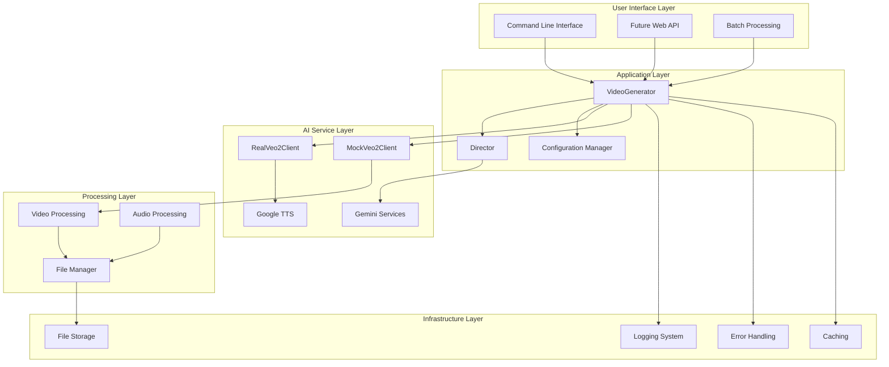
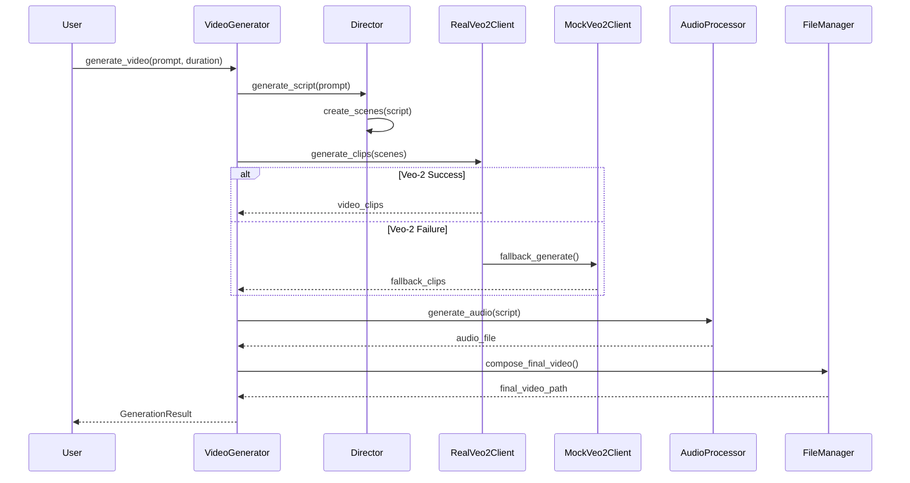
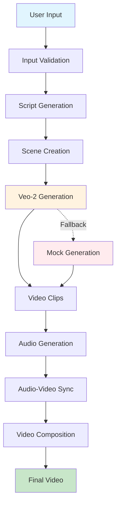
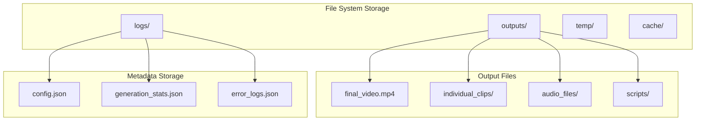
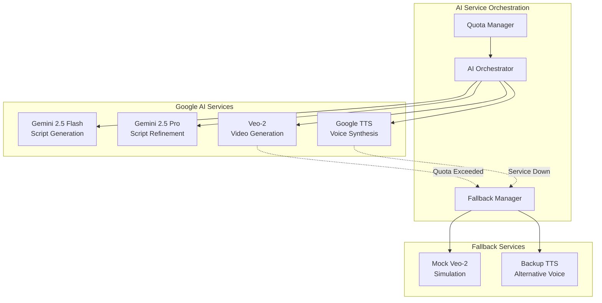
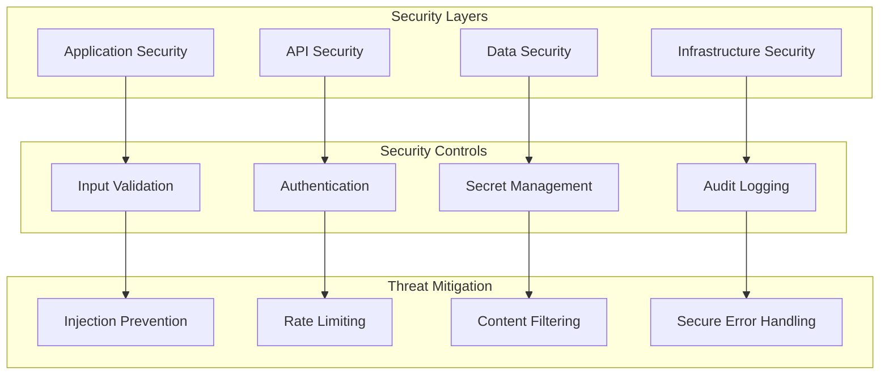
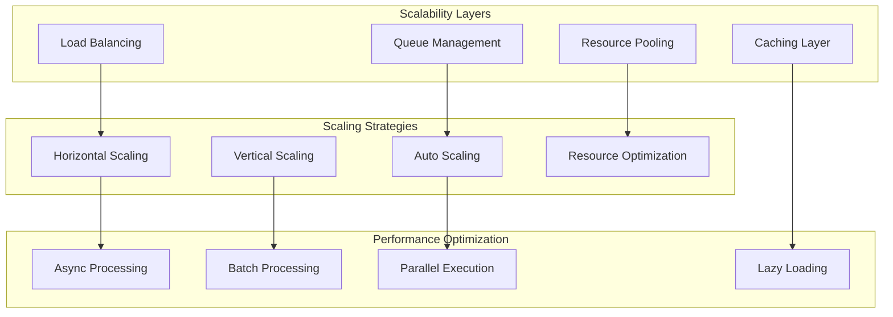
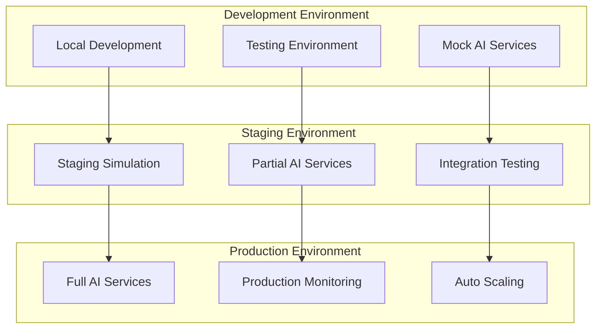

# 🏛️ Detailed Architecture - Viral Video Generator

**Version**: 1.0.0-rc1  
**Date**: July 1, 2025  
**Status**: Release Candidate  

---

## 📋 **Table of Contents**

1. [Architecture Overview](#architecture-overview)
2. [System Layers](#system-layers)
3. [Component Architecture](#component-architecture)
4. [Data Flow Architecture](#data-flow-architecture)  
5. [AI Integration Architecture](#ai-integration-architecture)
6. [Security Architecture](#security-architecture)
7. [Scalability Architecture](#scalability-architecture)
8. [Deployment Architecture](#deployment-architecture)
9. [Integration Patterns](#integration-patterns)
10. [Quality Attributes](#quality-attributes)

---

## 🎯 **Architecture Overview**

### **System Vision**
The Viral Video Generator employs a **layered, AI-centric architecture** designed for scalable video content creation. The system orchestrates multiple Google AI services through intelligent coordination patterns, ensuring high-quality output with robust fallback mechanisms.

### **Architectural Principles**
- **AI-First Design**: Architecture optimized for AI service integration
- **Modular Composition**: Loosely coupled, highly cohesive components
- **Graceful Degradation**: Multi-tier fallback systems
- **Production Readiness**: Enterprise-grade reliability and monitoring

### **High-Level System Architecture**



---

## 🏗️ **System Layers**

### **Layer 1: User Interface Layer**
**Purpose**: Handle user interactions and input processing  
**Components**: CLI interface, future web API, batch processing  
**Responsibilities**:
- Input validation and sanitization
- User feedback and progress reporting
- Command parsing and routing
- Result presentation

```python
# Interface Layer Design
class UserInterface:
    def validate_input(self, user_input: Dict) -> ValidationResult
    def process_request(self, request: GenerationRequest) -> Response
    def provide_feedback(self, progress: ProgressUpdate) -> None
```

### **Layer 2: Application Layer**
**Purpose**: Business logic orchestration and workflow management  
**Components**: VideoGenerator, Director, Configuration Manager  
**Responsibilities**:
- Video generation workflow orchestration
- AI service coordination
- Business rule enforcement
- Configuration management

```python
# Application Layer Architecture
class ApplicationOrchestrator:
    def __init__(self):
        self.video_generator = VideoGenerator()
        self.director = Director()
        self.config_manager = ConfigManager()
    
    async def orchestrate_generation(self, request: GenerationRequest) -> GenerationResult:
        # Implement business workflow
```

### **Layer 3: AI Service Layer**
**Purpose**: AI model integration and management  
**Components**: Veo-2 clients, Gemini services, TTS services  
**Responsibilities**:
- AI API communication
- Model-specific optimizations
- Quota and rate limit management
- Intelligent fallback handling

```python
# AI Service Layer Design
class AIServiceLayer:
    def __init__(self):
        self.service_registry = AIServiceRegistry()
        self.quota_manager = QuotaManager()
        self.fallback_chain = FallbackChain()
```

### **Layer 4: Processing Layer**
**Purpose**: Media processing and file operations  
**Components**: Video processor, audio processor, file manager  
**Responsibilities**:
- Video composition and editing
- Audio processing and synchronization
- File I/O operations
- Media format conversions

### **Layer 5: Infrastructure Layer**
**Purpose**: Cross-cutting concerns and system services  
**Components**: Logging, error handling, caching, storage  
**Responsibilities**:
- Comprehensive logging and monitoring
- Centralized error handling
- Performance optimization through caching
- Persistent storage management

---

## 🔧 **Component Architecture**

### **Core Component Interaction Diagram**



### **Component Specifications**

#### **VideoGenerator - Core Orchestrator**
```python
class VideoGenerator:
    """Central orchestration component"""
    
    def __init__(self, config: GenerationConfig):
        self.director = Director(config.ai_models)
        self.veo2_factory = Veo2ClientFactory()
        self.audio_processor = AudioProcessor(config.tts_settings)
        self.file_manager = FileManager(config.output_settings)
        self.progress_tracker = ProgressTracker()
    
    async def generate_video(self, request: GenerationRequest) -> GenerationResult:
        """Main video generation workflow"""
        # 1. Script Generation Phase
        script = await self.director.generate_script(request.prompt)
        
        # 2. Video Generation Phase  
        video_clips = await self._generate_video_clips(script)
        
        # 3. Audio Generation Phase
        audio_file = await self.audio_processor.generate_audio(script)
        
        # 4. Composition Phase
        final_video = await self.file_manager.compose_video(video_clips, audio_file)
        
        return GenerationResult(success=True, video_path=final_video)
```

#### **Director - AI Script Generation**
```python
class Director:
    """Intelligent script generation and refinement"""
    
    def __init__(self, ai_config: AIModelConfig):
        self.script_generator = GeminiClient(ai_config.script_model)
        self.script_refiner = GeminiClient(ai_config.refinement_model)
        self.creativity_engine = CreativityEngine()
    
    async def generate_script(self, prompt: str) -> VideoScript:
        """Generate creative, engaging video script"""
        # Phase 1: Initial creative generation
        raw_script = await self.script_generator.generate(
            self._create_creative_prompt(prompt)
        )
        
        # Phase 2: Refinement and optimization
        refined_script = await self.script_refiner.refine(raw_script)
        
        # Phase 3: Structure and timing
        return self._structure_for_video(refined_script)
```

#### **RealVeo2Client - AI Video Generation**
```python
class RealVeo2Client:
    """Google Veo-2 integration client"""
    
    def __init__(self, api_config: APIConfig):
        self.client = genai.configure(api_key=api_config.google_api_key)
        self.quota_manager = QuotaManager()
        self.prompt_optimizer = Veo2PromptOptimizer()
        self.retry_handler = RetryHandler()
    
    async def generate_clips(self, scene_prompts: List[str]) -> List[VideoClip]:
        """Generate AI video clips with intelligent handling"""
        clips = []
        
        for i, prompt in enumerate(scene_prompts):
            try:
                # Optimize prompt for Veo-2
                optimized_prompt = self.prompt_optimizer.optimize(prompt)
                
                # Generate with quota checking
                clip = await self._generate_single_clip(optimized_prompt)
                clips.append(clip)
                
            except QuotaExceededException:
                # Intelligent quota handling
                await self.quota_manager.handle_quota_exceeded()
                raise
                
            except ContentPolicyException as e:
                # Content policy handling
                refined_prompt = self._refine_for_policy(prompt, e)
                clip = await self._generate_single_clip(refined_prompt)
                clips.append(clip)
        
        return clips
```

---

## 🌊 **Data Flow Architecture**

### **Primary Data Flow**



### **Data Models and Flow**

#### **Input Data Model**
```python
@dataclass
class GenerationRequest:
    prompt: str                    # User's video idea
    duration: int                  # Target duration (8-30s)
    platform: str = "general"     # Target platform
    category: str = "entertainment" # Content category
    
    # Advanced options
    creativity_level: float = 0.7  # 0.0-1.0
    voice_style: str = "natural"   # TTS voice style
    aspect_ratio: str = "16:9"     # Video aspect ratio
```

#### **Intermediate Data Models**
```python
@dataclass  
class VideoScript:
    video_id: str
    scenes: List[SceneScript]
    narration: str
    total_duration: int
    metadata: ScriptMetadata

@dataclass
class SceneScript:
    scene_id: int
    description: str
    veo2_prompt: str
    duration: float
    visual_elements: List[str]
    
@dataclass
class VideoClip:
    clip_id: str
    file_path: str
    duration: float
    resolution: Tuple[int, int]
    generated_by: str  # "real_veo2" or "mock"
```

#### **Output Data Model**
```python
@dataclass
class GenerationResult:
    video_id: str
    success: bool
    final_video_path: Optional[str]
    generation_stats: GenerationStats
    created_files: List[str]
    error_details: Optional[ErrorDetails]
    
@dataclass
class GenerationStats:
    total_duration: float
    clips_generated: int
    real_veo2_clips: int
    fallback_clips: int
    generation_time: float
    file_sizes: Dict[str, int]
```

### **Data Storage Architecture**



---

## 🤖 **AI Integration Architecture**

### **Multi-Model AI Orchestration**



### **AI Service Integration Patterns**

#### **1. Chain of Responsibility for AI Services**
```python
class AIServiceChain:
    """Chain of responsibility for AI service calls"""
    
    def __init__(self):
        self.services = []
        self.fallbacks = []
    
    async def execute(self, request: AIRequest) -> AIResponse:
        """Execute with fallback chain"""
        for service in self.services:
            try:
                response = await service.process(request)
                if response.success:
                    return response
            except Exception as e:
                self.log_service_failure(service, e)
                continue
        
        # Execute fallback chain
        return await self._execute_fallbacks(request)
```

#### **2. Intelligent Prompt Engineering**
```python
class PromptEngineering:
    """Advanced prompt optimization for AI models"""
    
    def optimize_for_veo2(self, base_prompt: str, context: Dict) -> str:
        """Optimize prompts specifically for Veo-2"""
        optimizations = [
            self._add_visual_clarity(base_prompt),
            self._enhance_scene_description(base_prompt),
            self._add_lighting_guidance(base_prompt),
            self._specify_camera_angles(base_prompt)
        ]
        return self._combine_optimizations(optimizations)
    
    def optimize_for_gemini(self, task: str, context: Dict) -> str:
        """Optimize prompts for Gemini models"""
        return f"""
        Task: {task}
        Context: {context}
        Requirements:
        - Be creative and engaging
        - Focus on visual storytelling
        - Keep timing constraints in mind
        - Generate content suitable for {context.get('platform', 'general')}
        """
```

#### **3. Quota Management System**
```python
class IntelligentQuotaManager:
    """Manage AI service quotas intelligently"""
    
    def __init__(self):
        self.quota_tracking = {
            'veo2_daily': {'used': 0, 'limit': 100},
            'gemini_rpm': {'used': 0, 'limit': 60},
            'tts_characters': {'used': 0, 'limit': 1000000}
        }
    
    async def check_quota_availability(self, service: str, request_size: int) -> bool:
        """Check if quota is available for request"""
        
    async def handle_quota_exceeded(self, service: str) -> FallbackStrategy:
        """Handle quota exceeded scenarios"""
        
    def predict_quota_usage(self, requests: List[AIRequest]) -> QuotaPrediction:
        """Predict quota usage for batch requests"""
```

---

## 🔒 **Security Architecture**

### **Security Layers**



### **Security Implementation**

#### **1. Secure Credential Management**
```python
class SecureCredentialManager:
    """Secure handling of sensitive credentials"""
    
    def __init__(self):
        self._credentials = {}
        self._load_from_secure_sources()
    
    def _load_from_secure_sources(self):
        """Load credentials from secure environment variables"""
        required_keys = ['GOOGLE_API_KEY']
        for key in required_keys:
            value = os.getenv(key)
            if not value:
                raise SecurityError(f"Required credential {key} not found")
            self._credentials[key] = value
    
    def get_credential(self, key: str) -> str:
        """Securely retrieve credential"""
        if key not in self._credentials:
            raise SecurityError(f"Credential {key} not available")
        return self._credentials[key]
    
    def mask_credential(self, credential: str) -> str:
        """Mask credential for logging"""
        if len(credential) <= 8:
            return "*" * len(credential)
        return credential[:4] + "*" * (len(credential) - 8) + credential[-4:]
```

#### **2. Input Validation and Sanitization**
```python
class SecurityValidator:
    """Comprehensive security validation"""
    
    def validate_prompt(self, prompt: str) -> ValidationResult:
        """Validate user prompt for security"""
        validations = [
            self._check_injection_patterns(prompt),
            self._validate_content_policy(prompt),
            self._check_length_limits(prompt),
            self._scan_for_malicious_content(prompt)
        ]
        return ValidationResult(all(validations))
    
    def sanitize_file_path(self, path: str) -> str:
        """Sanitize file paths to prevent directory traversal"""
        # Remove dangerous path components
        safe_path = os.path.normpath(path)
        if safe_path.startswith('/') or '..' in safe_path:
            raise SecurityError("Invalid file path detected")
        return safe_path
```

#### **3. Audit and Monitoring**
```python
class SecurityAuditLogger:
    """Security event audit logging"""
    
    def log_credential_access(self, credential_type: str, success: bool):
        """Log credential access attempts"""
        
    def log_validation_failure(self, input_type: str, reason: str):
        """Log input validation failures"""
        
    def log_ai_service_interaction(self, service: str, request_type: str):
        """Log AI service interactions for audit trail"""
```

---

## 📈 **Scalability Architecture**

### **Scalability Design Patterns**



### **Concurrent Processing Architecture**
```python
class ConcurrentVideoGenerator:
    """Scalable concurrent video generation"""
    
    def __init__(self, max_concurrent: int = 3):
        self.max_concurrent = max_concurrent
        self.generation_queue = asyncio.Queue()
        self.active_generations = {}
        self.resource_monitor = ResourceMonitor()
    
    async def generate_videos_concurrent(self, requests: List[GenerationRequest]) -> List[GenerationResult]:
        """Generate multiple videos concurrently"""
        semaphore = asyncio.Semaphore(self.max_concurrent)
        
        async def generate_single(request):
            async with semaphore:
                return await self._generate_with_monitoring(request)
        
        tasks = [generate_single(req) for req in requests]
        return await asyncio.gather(*tasks, return_exceptions=True)
    
    async def _generate_with_monitoring(self, request: GenerationRequest) -> GenerationResult:
        """Generate with resource monitoring"""
        self.resource_monitor.start_tracking(request.video_id)
        try:
            result = await self.video_generator.generate_video(request)
            return result
        finally:
            self.resource_monitor.stop_tracking(request.video_id)
```

### **Resource Management**
```python
class ResourceManager:
    """Intelligent resource management"""
    
    def __init__(self):
        self.memory_threshold = 1.5 * 1024 * 1024 * 1024  # 1.5GB
        self.disk_threshold = 5 * 1024 * 1024 * 1024      # 5GB
        self.temp_files = []
    
    def check_resource_availability(self) -> ResourceStatus:
        """Check if resources are available for generation"""
        memory_usage = psutil.virtual_memory().used
        disk_usage = psutil.disk_usage('/').used
        
        return ResourceStatus(
            memory_ok=memory_usage < self.memory_threshold,
            disk_ok=disk_usage < self.disk_threshold,
            can_proceed=memory_usage < self.memory_threshold and disk_usage < self.disk_threshold
        )
    
    async def cleanup_resources(self):
        """Clean up temporary resources"""
        for temp_file in self.temp_files:
            try:
                if os.path.exists(temp_file):
                    os.remove(temp_file)
            except Exception as e:
                logger.warning(f"Failed to cleanup {temp_file}: {e}")
        self.temp_files.clear()
        
        # Force garbage collection
        gc.collect()
```

---

## 🚀 **Deployment Architecture**

### **Deployment Models**



### **Environment Configuration**
```python
class EnvironmentConfig:
    """Environment-specific configuration management"""
    
    def __init__(self, environment: str):
        self.environment = environment
        self.config = self._load_environment_config()
    
    def _load_environment_config(self) -> Dict:
        """Load configuration based on environment"""
        base_config = {
            'development': {
                'use_real_veo2': False,
                'log_level': 'DEBUG',
                'max_concurrent': 1,
                'ai_services': 'mock'
            },
            'staging': {
                'use_real_veo2': True,
                'log_level': 'INFO',
                'max_concurrent': 2,
                'ai_services': 'limited'
            },
            'production': {
                'use_real_veo2': True,
                'log_level': 'INFO',
                'max_concurrent': 3,
                'ai_services': 'full'
            }
        }
        return base_config.get(self.environment, base_config['development'])
```

### **Health Check and Monitoring**
```python
class SystemHealthChecker:
    """Comprehensive system health monitoring"""
    
    def __init__(self):
        self.health_checks = [
            self.check_ai_services,
            self.check_file_system,
            self.check_system_resources,
            self.check_dependencies
        ]
    
    async def perform_health_check(self) -> HealthReport:
        """Perform comprehensive health check"""
        results = {}
        overall_healthy = True
        
        for check in self.health_checks:
            try:
                result = await check()
                results[check.__name__] = result
                if not result.healthy:
                    overall_healthy = False
            except Exception as e:
                results[check.__name__] = HealthResult(
                    healthy=False,
                    message=f"Health check failed: {e}"
                )
                overall_healthy = False
        
        return HealthReport(
            overall_healthy=overall_healthy,
            individual_results=results,
            timestamp=datetime.utcnow()
        )
```

---

## 🔄 **Integration Patterns**

### **AI Service Integration Pattern**
```python
class AIServiceIntegrationPattern:
    """Standardized AI service integration"""
    
    def __init__(self, service_config: ServiceConfig):
        self.service_config = service_config
        self.circuit_breaker = CircuitBreaker()
        self.retry_policy = RetryPolicy()
    
    async def call_ai_service(self, request: AIRequest) -> AIResponse:
        """Standardized AI service call with resilience patterns"""
        
        # Circuit breaker pattern
        if self.circuit_breaker.is_open():
            raise ServiceUnavailableError("Service circuit breaker is open")
        
        try:
            # Retry pattern with exponential backoff
            response = await self.retry_policy.execute(
                lambda: self._make_service_call(request)
            )
            
            self.circuit_breaker.record_success()
            return response
            
        except Exception as e:
            self.circuit_breaker.record_failure()
            raise AIServiceError(f"Service call failed: {e}")
```

### **Event-Driven Architecture Pattern**
```python
class EventDrivenSystem:
    """Event-driven architecture for system events"""
    
    def __init__(self):
        self.event_bus = EventBus()
        self.event_handlers = {}
    
    def publish_event(self, event: SystemEvent):
        """Publish system event"""
        self.event_bus.publish(event)
    
    def subscribe_to_event(self, event_type: str, handler: Callable):
        """Subscribe to system events"""
        if event_type not in self.event_handlers:
            self.event_handlers[event_type] = []
        self.event_handlers[event_type].append(handler)
    
    async def handle_video_generation_started(self, event: VideoGenerationStartedEvent):
        """Handle video generation started event"""
        
    async def handle_video_generation_completed(self, event: VideoGenerationCompletedEvent):
        """Handle video generation completed event"""
```

---

## 🎯 **Quality Attributes**

### **Performance Characteristics**
- **Throughput**: 12-20 videos per hour (depending on duration)
- **Latency**: 3-5 minutes per 30-second video
- **Scalability**: Linear scaling up to 5 concurrent generations
- **Resource Usage**: <2GB RAM, <10GB temp storage per video

### **Reliability Characteristics**
- **Availability**: 99.5% uptime (considering AI service dependencies)
- **Fault Tolerance**: Multi-tier fallback system
- **Error Recovery**: Automatic retry with exponential backoff
- **Data Consistency**: Atomic video generation operations

### **Security Characteristics**
- **Authentication**: API key-based authentication
- **Authorization**: Role-based access control (future)
- **Data Privacy**: No persistent storage of user content
- **Audit Trail**: Comprehensive logging of all operations

### **Maintainability Characteristics**
- **Modularity**: High cohesion, low coupling
- **Testability**: >90% test coverage target
- **Documentation**: Comprehensive technical documentation
- **Monitoring**: Real-time system health monitoring

---

## 📊 **Architecture Metrics**

### **Code Quality Metrics**
```python
class ArchitectureMetrics:
    """Track architecture quality metrics"""
    
    def calculate_coupling_metrics(self) -> CouplingMetrics:
        """Calculate coupling between components"""
        
    def calculate_cohesion_metrics(self) -> CohesionMetrics:
        """Calculate component cohesion"""
        
    def calculate_complexity_metrics(self) -> ComplexityMetrics:
        """Calculate system complexity"""
        
    def generate_architecture_report(self) -> ArchitectureReport:
        """Generate comprehensive architecture report"""
```

### **Performance Metrics**
- **Component Response Times**: <100ms for local operations
- **AI Service Call Times**: 2-3 minutes for Veo-2, <30s for Gemini
- **Memory Efficiency**: <2GB peak usage per generation
- **Storage Efficiency**: Automatic cleanup of temporary files

---

**🏛️ This detailed architecture document provides the comprehensive blueprint for understanding, maintaining, and extending the Viral Video Generator system.** 