# Architecture Documentation with Diagrams
## Viral Video Generator System

**Version:** 1.0  
**Date:** December 2024

---

## 1. System Overview

The Viral Video Generator is a cloud-native, AI-powered system designed for automated social media video creation based on viral pattern analysis.

### 1.1 High-Level Architecture

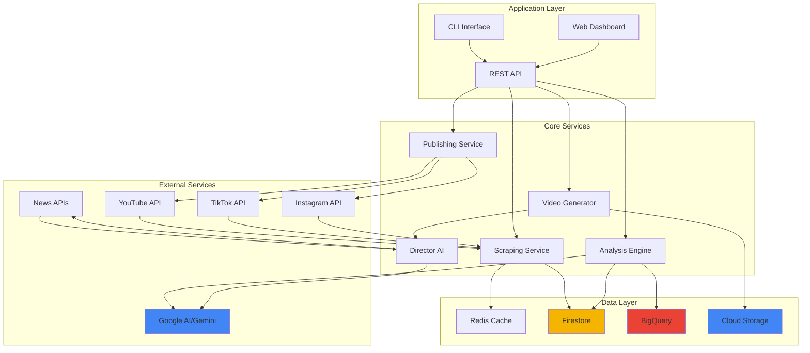

## 2. Component Architecture

### 2.1 Service Components

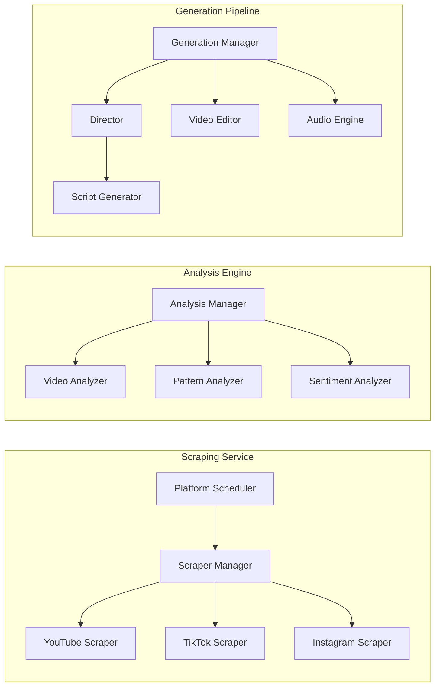

### 2.2 Data Flow Architecture

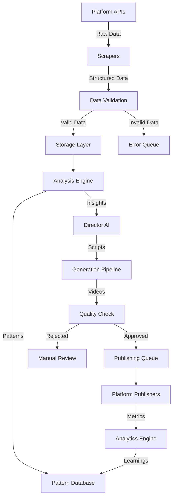

## 3. Detailed Component Design

### 3.1 Director AI Architecture

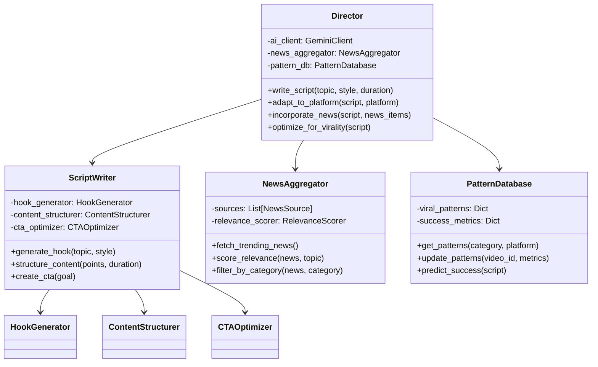

### 3.2 Error Handling Flow

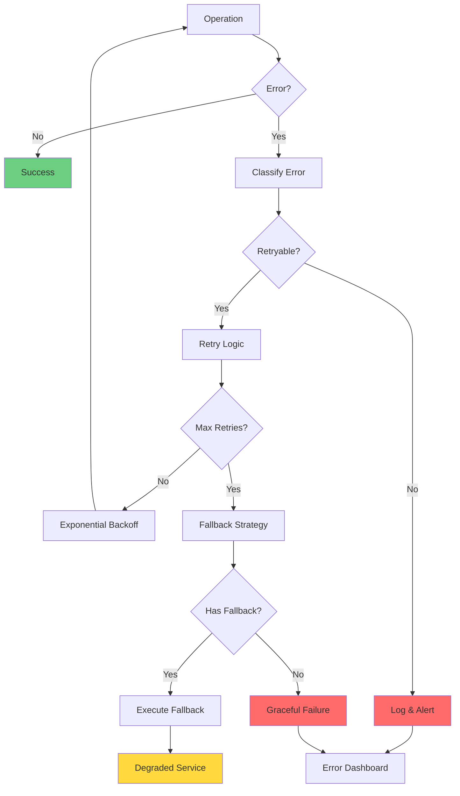

## 4. Database Schema

### 4.1 Entity Relationship Diagram

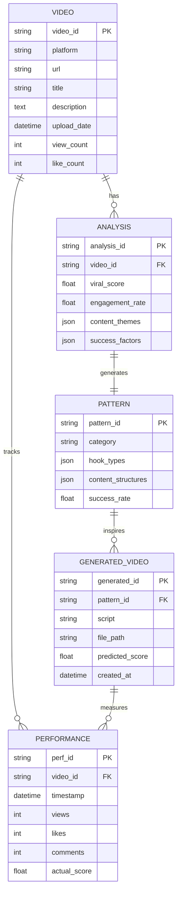

## 5. Deployment Architecture

### 5.1 Kubernetes Deployment

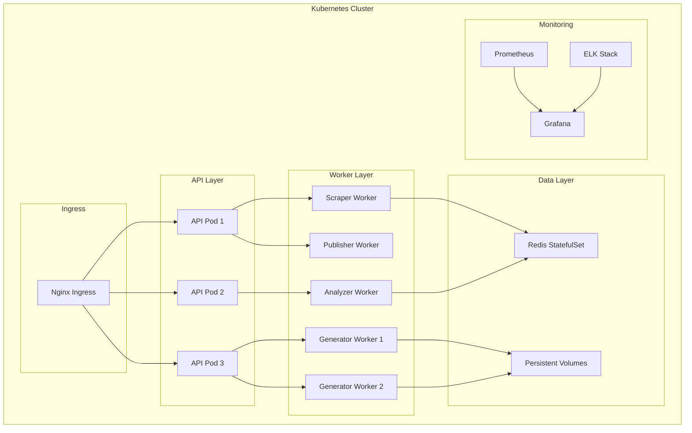

### 5.2 CI/CD Pipeline

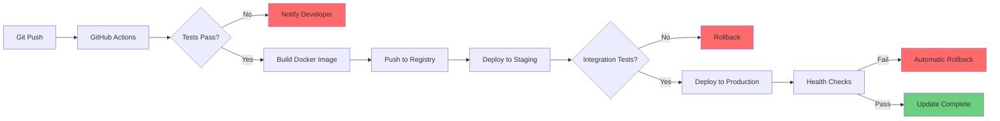

## 6. Security Architecture

### 6.1 Security Layers

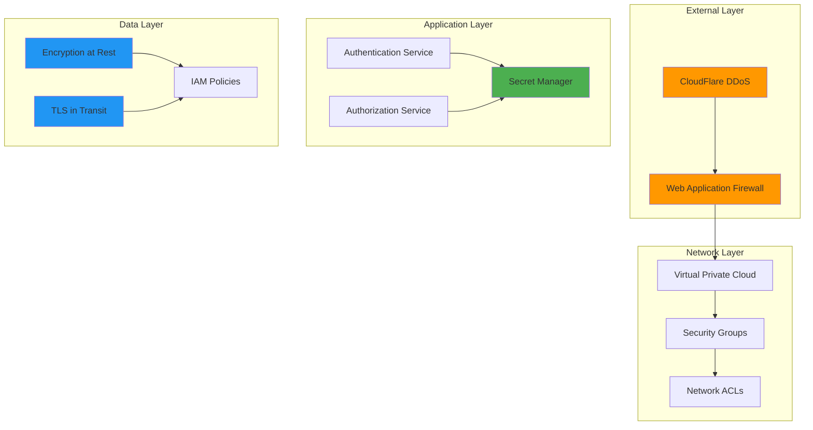

## 7. Monitoring Architecture

### 7.1 Observability Stack

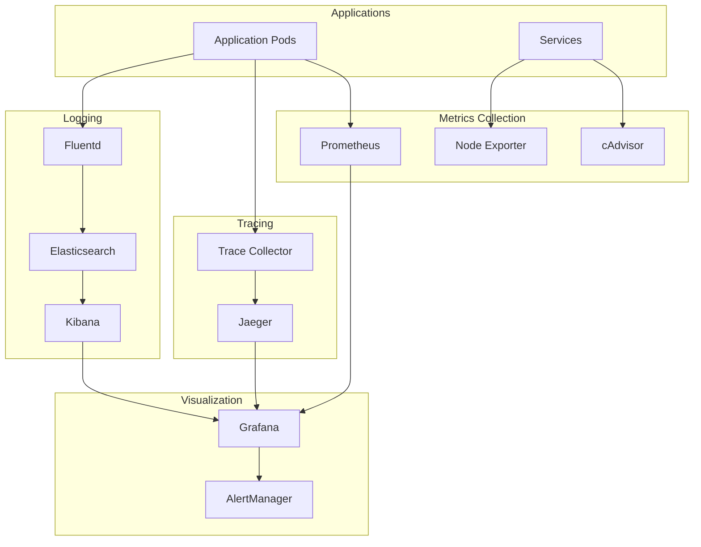

## 8. Performance Architecture

### 8.1 Caching Strategy

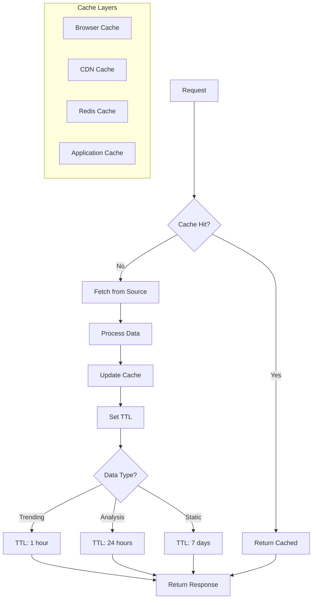

### 8.2 Load Balancing

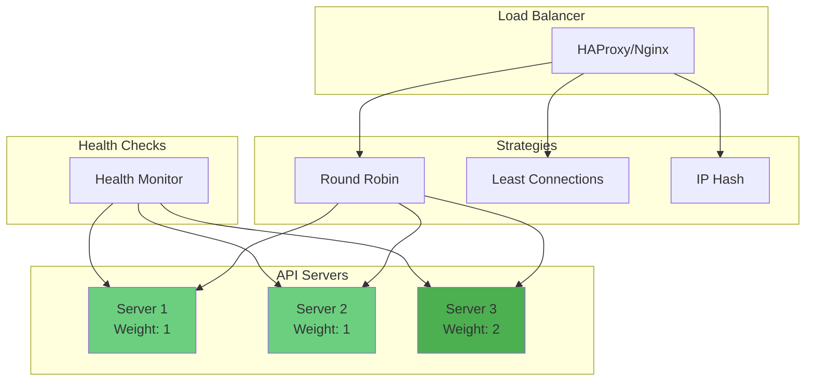

## 9. Disaster Recovery

### 9.1 Backup Strategy

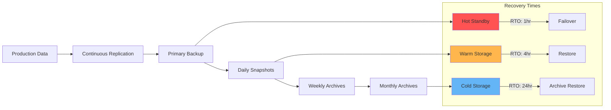

---

**Document Version History:**
- v1.0 - Initial architecture documentation
- Next Review: Q1 2025 